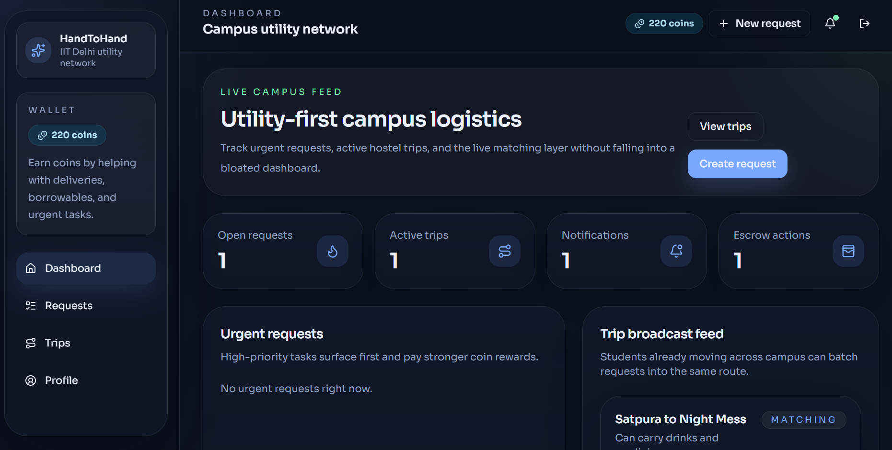
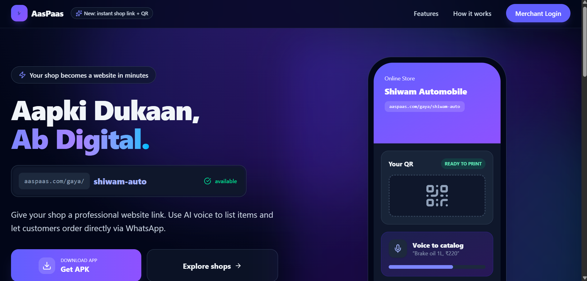
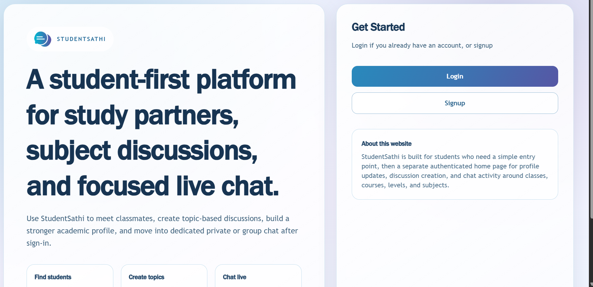
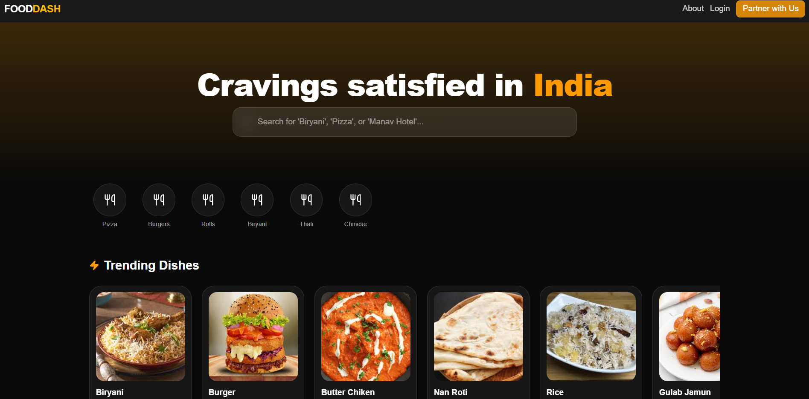

## Hi there 👋

<!--
**mdarmanadl-byte/mdarmanadl-byte** is a ✨ _special_ ✨ repository because its `README.md` (this file) appears on your GitHub profile.

Here are some ideas to get you started:

- 🔭 I’m currently working on ...
- 🌱 I’m currently learning ...
- 👯 I’m looking to collaborate on ...
- 🤔 I’m looking for help with ...
- 💬 Ask me about ...
- 📫 How to reach me: ...
- 😄 Pronouns: ...
- ⚡ Fun fact: ...
-->
# 💫 About Me:
Delhi IIT pass out  
Full Stack Engineer • Backend and Frontend • ML • DSA • Analytics  

---

## 🚀 Expertise

### 💻 Full Stack Development
- Build end-to-end scalable web applications
- Strong backend-first architecture mindset
- REST APIs, PostgreSQL & real-time systems
- Authentication, authorization & security
- Cloud-native deployment with Docker & CI/CD
- SQL & NoSQL database design & optimization

**Frontend**
- Next.js (App Router)
- React.js
- Redux / Redux Toolkit
- Tailwind CSS
- Responsive & performance-focused UI

**Backend**
- Node.js
- Express.js
- API design & versioning
- Background jobs & queues
- Caching & performance tuning

---

### 🧠 Data Structures & Algorithms
- Strong problem-solving mindset
- Optimized solutions with time & space complexity awareness
- Competitive programming experience

**Core Topics**
- Arrays, Strings, Linked Lists
- Trees, Graphs, Heaps
- Dynamic Programming
- Greedy Algorithms
- Sliding Window & Two Pointers
- Recursion & Backtracking

---

### 🤖 AI Engineering & LLM Systems
- RAG pipelines with vector databases
- Embeddings, semantic search & retrieval systems
- AI agents & workflow orchestration (ADK/LangGraph)
- Prompt engineering & context management
- LLM integrations using OpenAI, Claude & open-source models
- Streaming AI responses & real-time chat systems
- Evaluation, caching & inference optimization

---

### 📊 Data Analyst / Analytics
- Data cleaning & transformation
- SQL-heavy analytics
- KPI dashboards & insights
- Business-driven analysis

---

### 🛠️ Engineering Mindset
- Clean, maintainable & scalable code
- Design patterns & best practices
- Debugging-first approach
- Performance & edge-case focused

---

### 🎯 Interests
- System Design & Scalability
- Backend & Infrastructure
- High-performance web apps
- ML systems in production

---
### 🚀 Projects

#### HandToHand
Peer-to-peer platform focused on seamless user interaction and scalable backend architecture.
Tech: React, Node.js, PostgreSQL, Tailwind, JWT Auth

🔗 https://handtohand-pi.vercel.app

---

#### Aas-Pass
Location/community-based web application with responsive UI and real-time features.
Tech: React, Express.js, MongoDB

🔗 https://aas-pass.vercel.app

---

#### StudentSathi
Student-focused platform for collaboration and academic support.
Tech: MERN Stack, REST APIs, Authentication

🔗 https://studentsathi-pi.vercel.app

---

#### FoodDelivery
Food ordering and delivery platform with modern UI and backend integration.
Tech: React, Node.js, Database Integration

🔗 https://fooddelivery1-two.vercel.app

## 🌱 Currently Learning
- System Design
- Distributed Systems
- AI Agent Workflows
- Kubernetes & Cloud Infrastructure

## 💻 Tech Stack:

---

## 📊 GitHub Stats:

---

<!-- Proudly created with GPRM ( https://gprm.itsvg.in ) -->
